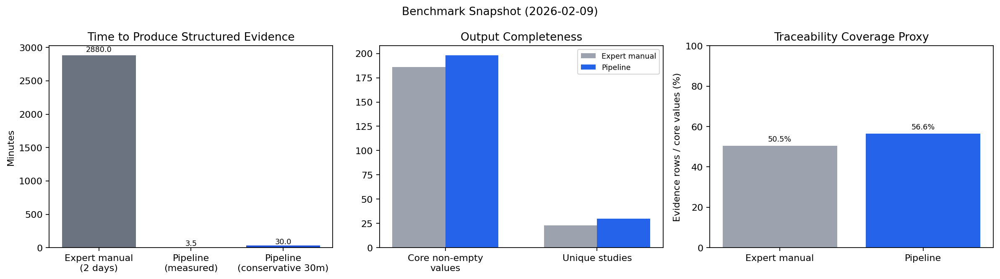

# General Research + PubMed Pipeline

A user-facing research workflow for turning scattered papers into structured, auditable evidence.

## Who This Is For
- Research teams doing literature reviews
- Clinical/scientific ops teams filling evidence tables
- Analysts who need traceable quotes, not summaries only

## What It Does
- Finds relevant papers from multiple research sources
- Prioritizes fulltext evidence for core fields
- Extracts structured values and links each value to evidence
- Records missing reasons when a field cannot be filled

## Performance Snapshot (Measured)

Expert baseline label (user-provided): **Harvard Medical School MD+PhD, pharma experience**, manual extraction workload around **2 days**.

| Metric | Expert manual baseline | Pipeline (measured) | Pipeline (conservative 30m) | Improvement |
|---|---:|---:|---:|---:|
| Time to deliver structured evidence | 2880 min (2 days) | 3.5 min | 30 min | 822x faster (measured) / 96x faster (conservative) |
| Core non-empty values | 186 | 198 | 198 | +12 (+6.5%) |
| Unique studies captured | 23 | 30 | 30 | +7 (+30.4%) |
| Traceability coverage proxy (evidence rows / core values) | 50.5% | 56.6% | 56.6% | +6.1 pp |
| Evidence mapping pass rate | N/A | 100% | 100% | Higher auditability |



Benchmark files:
- `assets/benchmark_snapshot_2026-02-09.csv`
- `assets/benchmark_snapshot_2026-02-09.json`

## Typical Use Cases
- Endpoint extraction from clinical trial papers
- Building evidence tables for internal review
- Updating research FAQs with source-backed claims
- Rapid gap analysis: what is known vs not reported

## Coverage (Current)
- Source registry: 29 sources
- Source families: literature, guidelines, regulatory, institutions
- Evidence policy: fulltext-first for core data

## How The Workflow Runs
1. Define what needs to be filled and how success is measured.
2. Retrieve candidate papers from multiple sources.
3. Download and parse fulltexts.
4. Extract target fields and normalize terms.
5. Output three aligned layers:
   - Results (filled values)
   - Evidence (quote + source + location)
   - Missing reasons (why unfilled)
6. Run quality checks for traceability and consistency.

## What You Get
- Faster evidence extraction with less manual copy/paste
- A clear audit trail for every filled value
- Explicit handling of uncertainty and missing data

## Start in 3 Steps
```bash
# 1) Retrieve candidates
python3 src/paper_hub.py search-multi \
  --query "your research question" \
  --sources pubmed,crossref,semantic

# 2) Download fulltext candidates
python3 src/paper_hub.py download-batch \
  --input-jsonl downloads/candidate_papers.jsonl \
  --output-dir downloads

# 3) Parse artifacts
python3 src/paper_hub.py parse \
  --mode bioc \
  --input-dir downloads \
  --output downloads/parsed_bioc.jsonl
```

## Core Docs
- SOP: `SOP_endpoint_extraction_standard.md`
- Main entrypoint: `src/paper_hub.py`
