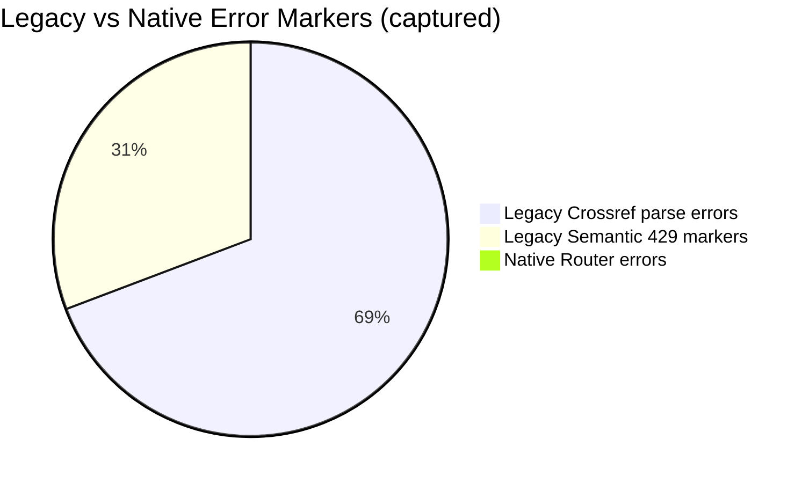

# Pubmed-max

**World's best PubMed-centric medical evidence retrieval and audit pipeline** for clinical evidence workbooks.

Pubmed-max is built for one thing: **never break, always explain, always trace back to source**.

## Why this is different

- Reliability first: source-router with graceful fallback (no hard crash on 429/dirty payloads)
- Medical-grade auditability: every datum can map back to evidence (`datum_id`, source, location, quote)
- Decision-ready outputs: clean Excel with dictionary-first layout, consistent schema, and review-friendly formatting
- Clinical logic: survival / tumor-control / safety-QOL tasks are separated and MECE

## Hard comparison (same query, same limits)

Query:
`pancreatic cancer randomized phase III LAPC MPC overall survival progression-free survival ORR CTCAE quality of life QALY`

| Source | Legacy MCP rows | Native router rows | Legacy runtime (s) | Native runtime (s) | Legacy error markers | Native error markers |
|---|---:|---:|---:|---:|---:|---:|
| Crossref | 11 | 20 | 3.221 | 2.836 | 9 parse-error logs | 0 |
| Semantic | 0 | 0 | 8.392 | 1.141 | 4 rate-limit logs | 0 |

### Error noise comparison

## Readability upgrade: field dictionary order

Before (hard to review):
`12mPFS/%`, `1yOS/%`, `5yOS/%`, `6mPFS/%`, `AE术语`, ...

After (clinical-first):
`临床试验`, `方式`, `类别`, `治疗方案`, `研究人群`, `n`, `研究时间`, `随访时间/月`, `发表时间`, ...

## Deliverables (examples)

- Workbook: `examples/pancreatic_evidence_workbook.xlsx`
- Access audit: `examples/access_audit_quickcheck.csv`
- Download manifest: `examples/download_manifest_quickcheck.csv`
- Full comparison: `reports/COMPARISON_2026-02-09.md`
- Machine-readable metrics: `reports/comparison_metrics_2026-02-09.json`

## Repository layout

- `src/paper_hub.py` — unified search/router/download/audit pipeline
- `src/build_pancreatic_workbook.py` — workbook builder with styling and validation
- `src/dimensions_catalog.yaml` — dynamic dimension registry
- `src/source_registry.yaml` — source/institution reliability registry
- `reports/` — benchmark and comparison outputs

## Product principles

1. **No silent failure**: if data is missing, it is explicitly audited.
2. **No black-box extraction**: evidence table always keeps traceability fields.
3. **No quality downgrade**: quality guard blocks regressions in core evidence.
4. **No illegal bypass**: only legal/public access channels are used.

## Positioning

Pubmed-max is designed as the **most reliable and explainable PubMed-first medical retrieval engine** for real clinical evidence synthesis workflows.
